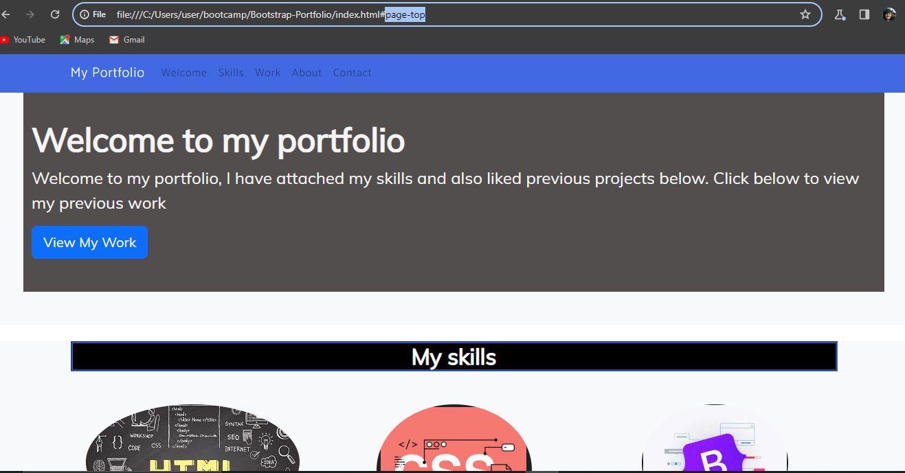
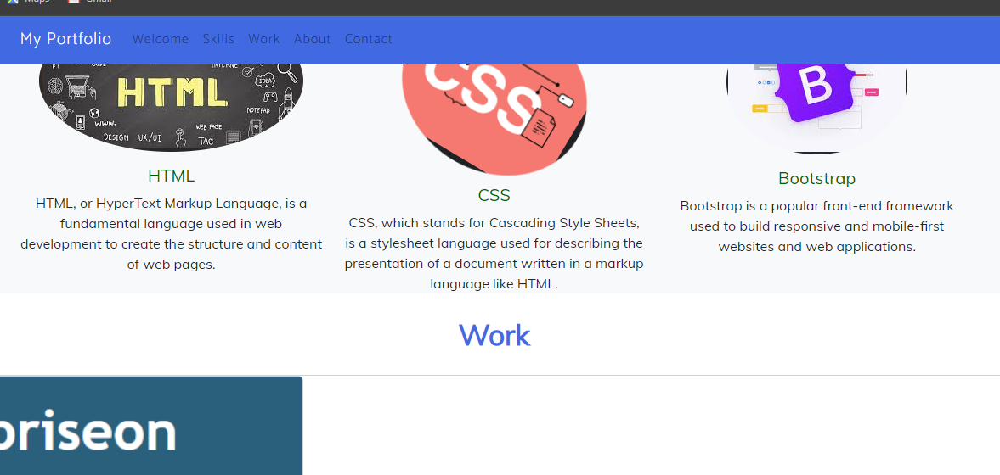

# Bootstrap-Portfolio
Description creating a fucctional portfolio website that will follow links and was made with bootstrap and CSS and HTML.

The motivation behind creating the portfolio is to build upon this and showcase my own work in this format.

Our project stands out because of its user-friendly interface, clarity in information dissemination, and the expertise behind every service offering.

I have also added transition on to skills images that will rotate when the mouse is hovered over it.

Installation Clone the repository from GitHub link: git@github.com:Sufgaz/Bootstrap-Portfolio.git. Navigate to the project directory. Open index.html in your browser.

The main page has a navigation header to switch between different service offerings. Each section provides a small description about the service and an image to enhance user's understanding.

Credits This project was solely developed by Sufyan Gajra - git@github.com:Sufgaz/Bootstrap-Portfolio.git

For assets and images, credit goes to edX Bootcamp.

Below is a screenshot of the deployed site 

